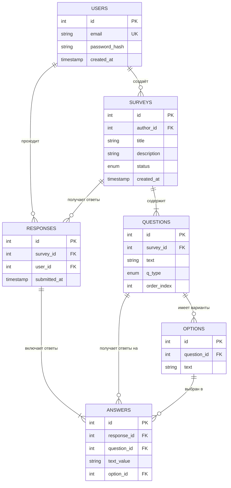

##  ER-диаграмма базы данных

```mermaid
erDiagram
    USERS ||--o{ SURVEYS : "создаёт"
    USERS ||--o{ RESPONSES : "проходит"
    SURVEYS ||--|{ QUESTIONS : "содержит"
    QUESTIONS ||--o{ OPTIONS : "имеет варианты"
    SURVEYS ||--o{ RESPONSES : "получает ответы"
    RESPONSES ||--|{ ANSWERS : "включает ответы"
    QUESTIONS ||--o{ ANSWERS : "получает ответы на"
    OPTIONS ||--o{ ANSWERS : "выбран в"

    USERS {
        int id PK
        string email UK
        string password_hash
        timestamp created_at
    }
    
    SURVEYS {
        int id PK
        int author_id FK
        string title
        string description
        enum status
        timestamp created_at
    }
    
    QUESTIONS {
        int id PK
        int survey_id FK
        string text
        enum q_type
        int order_index
    }
    
    OPTIONS {
        int id PK
        int question_id FK
        string text
    }
    
    RESPONSES {
        int id PK
        int survey_id FK
        int user_id FK
        timestamp submitted_at
    }
    
    ANSWERS {
        int id PK
        int response_id FK
        int question_id FK
        string text_value
        int option_id FK
    }
```